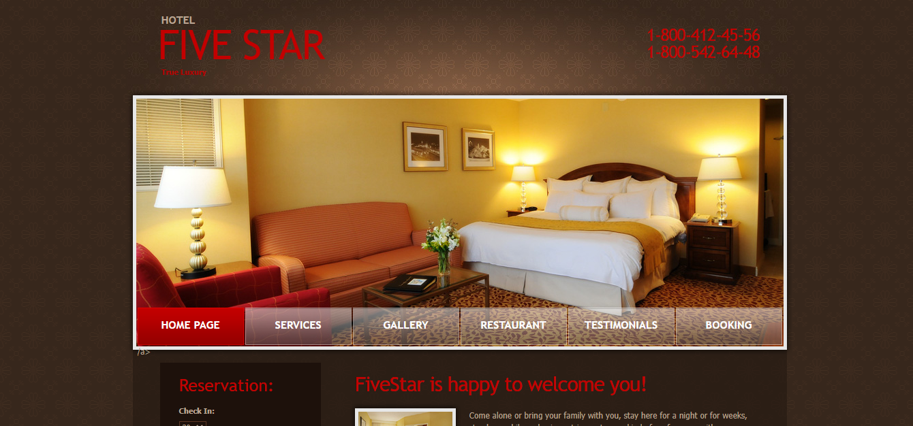

## Introduction
FiveStar is a hotel management web application that enables hotel managers and owners to simplify administrative tasks while increasing short and long term bookings.

## Informations
-   Status: under development
- Lastest version: 1.0
- Sector Tourism
- Created: November 2020
- Last updated: November 2020

## Table of contents
* [Documentation](#general-info)
* [Demo](#demo)
* [Screenshots](#screenshots)
* [Technologies](#technologies)
* [Setup](#setup)
* [Features](#features)
* [Status](#status)
* [Contact](#contact)
* [License](#license)

## Documentation
https://github.com/aniskchaou/FIVE-STAR-HOTEL-FRONTOFFICE-USER

## Demo
https://five-star-hotel.herokuapp.com/

## Screenshots

## Technologies
* PHP
* Symfony

## Setup

## Features
 -  Reservations management
 - Personnel management
 - Maintenance monitoring

## Contact
contact@delta-dev-software.com

## License
<a href="license.txt">MIT License</a>